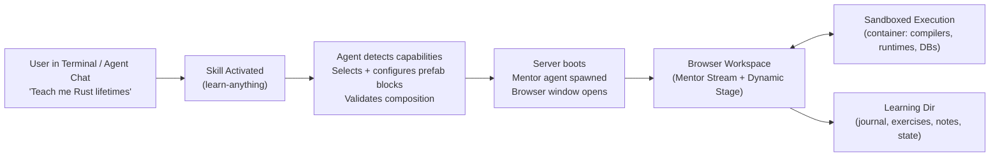

# `learn-anything` Constructor-Kit Design Specification

> **Status:** v0.3 — product framing corrected. The learning-experience goal is fixed; implementation blocks are selected and adapted by the invoking agent. See §10 for default selections and §11 for open items.

## 1. Executive Summary

**`learn-anything`** is a constructor skill and asset set for local coding agents (Claude Code, Antigravity, and others). When a user asks to learn something, the invoking agent uses the kit to assemble a tailored interactive, visual, adaptive learning workspace for virtually any topic — programming languages (Rust, Python, C++), deep technical concepts (building an LLM, system design), practical software tools (Excel formulas & data modeling), or live codebases (local project folders, GitHub repos).

The npm package does **not** try to be one finished application that directly supports every harness and operating system. It ships the skill instructions, complete reusable server/frontend blocks, adapters, templates, schemas, reference implementations, and validation guidance needed by a capable local agent. The invoking agent detects the host and harness, selects compatible blocks, writes only the necessary environment-specific glue, verifies the composition, and launches it.

**Non-negotiable outcome:** the learner gets a usable dynamic browser interface that adapts to the course, current lesson, exercises, and learning flow. **Preferred reference architecture:** a visible browser workspace, a headless mentor, and a server-owned streaming loop using A2UI over AG-UI. Equivalent blocks may replace that protocol or bridge when the current harness cannot support it, provided the browser experience still meets the outcome.

### 1.1 Artifact model

- **Constructor kit** — the npm-published skill and all prefab assets in this repository. This is the product being built.
- **Block** — a reusable implementation asset such as the browser workspace, event bridge, mentor adapter, sandbox runner, component catalog, persistence layer, or pedagogical prompt set.
- **Composition** — the compatible set of blocks and minimal glue selected by the invoking agent for the current machine, harness, topic, and user request.
- **Learning workspace** — the runnable browser-based experience produced by that composition. It is an assembled output, not the published product itself.

---

## 2. Core User Experience & Workflow



1. **Triggering** — the user tells their local coding agent: `"Let's start learning [Topic/Repo/Feature]"` (e.g. *"Teach me Rust async channels"*, *"Explain how this GitHub repo works: https://github.com/..."*, *"Practice Excel XLOOKUP with exercises"*).
2. **Capability detection and composition** — the invoking agent inspects the harness, operating system, available runtimes, container support, browser launch path, and optional capabilities. It selects compatible prefab blocks and records the composition.
3. **Session launch** — the invoking agent creates or resumes the learning directory, configures and smoke-tests the selected blocks, boots the local server, connects the mentor, and opens the browser.
4. **Interactive mentorship** — all conversation, code writing, execution, visual explanation, and exercise feedback happen in the browser. After launch the learner never needs to return to the terminal.
5. **Resumability** — every session persists to its own directory with notes, journal, solved code, the selected composition, and both agent-session and UI-state checkpoints (§6).

### 2.1 The terminal agent's role after launch

The terminal agent is the **launcher and supervisor**, not the mentor. It remains free and unblocked:

- Runs the skill, detects capabilities, selects and configures blocks, picks the topic, seeds the mentor's system prompt, and may hand over its own context when the harness supports it.
- Stays available for side conversation — inspecting `.learnings/`, adjusting the lesson plan, restarting the mentor.
- Supervises: if the mentor process dies, the terminal agent relaunches it.

**Preferred-profile tradeoff:** the mentor is a separate session from the terminal session. This enables token streaming in the reference composition; continuity is preserved by resumability, not by session identity. A harness may use another bridge if it provides equivalent browser interaction and continuity.

---

## 3. Preferred Protocol Profile: A2UI over AG-UI

Two open protocols provide the preferred, most capable block pairing. The constructor should select them when compatible, but they are not mandatory if another block can preserve the required dynamic browser experience.

| Layer | Protocol | Owns |
|---|---|---|
| Transport / events | **AG-UI** (Agent-User Interaction Protocol) | Bidirectional event stream, streaming chat text, tool-call visibility, state deltas, user actions back to the agent |
| Interactive surface | **A2UI** (Agent-to-User Interface, Google, Apache 2.0) | Declarative JSON description of the right-hand stage: components, properties, data model |

**In the reference profile, A2UI messages ride inside AG-UI events.** This is the pairing documented jointly by Google and CopilotKit.

Fallbacks must preserve the behavioral contract, not necessarily these wire protocols: live or progressively delivered mentor output where possible, user actions back to the mentor, visible execution feedback, persistent state, and a stage that can change with the lesson flow. Any reduced capability must be made explicit to the learner rather than silently removed.

### 3.1 Why both

A2UI is a declarative UI description format — four message types (`createSurface`, `updateComponents`, `updateDataModel`, `deleteSurface`) plus a catalog of pre-approved components, so no executable code crosses the trust boundary. It explicitly **does not** carry streaming agent text.

The mentor stream is streaming agent text. AG-UI supplies that layer: ~16 event types across lifecycle (`RUN_STARTED`/`RUN_FINISHED`), text (`TEXT_MESSAGE_START`/`CONTENT`/`END`), tool calls (`TOOL_CALL_START`/`ARGS`/`RESULT`), state (`STATE_SNAPSHOT`/`STATE_DELTA`), and `CUSTOM`.

### 3.2 Custom component catalog

Stock A2UI does not supply every subject-native learning surface. This kit's current custom catalog provides editable artifacts, structured tables, annotated passages, figures, safe mathematical notation, bounded numeric plots, locally reactive precomputed parameter frames, Mermaid, quizzes, and callouts. Specialized surfaces such as spreadsheet grids or attention heatmaps are optional future prefab blocks; agents must not promise them until selected blocks actually provide them. Building a renderer is real work, not a free protocol feature.

---

## 4. Reference Agent Bridge Architecture

### 4.1 Why the server owns the loop

In the preferred composition, the mentor streams tokens as they are generated. A turn-based agent that only speaks when its turn completes produces a wall of text, not a conversation. Therefore the reference server drives the loop, and the mentor runs as a long-lived process fed messages over time.

```
Browser (React + A2UI renderer + persistent code editor)
   ▲  AG-UI events over SSE          │  user actions (HTTP POST)
   │                                 ▼
              Node server  —— owns the loop ——
   ▲  agent message stream            │  yield user message
   │                                  ▼
       Mentor agent (headless, streaming input mode)
                    │ Bash / Edit tools
                    ▼
       Sandbox container  +  .learnings/<topic>/
```

### 4.2 Reference message flow

1. The invoking agent starts the selected server block, spawns the mentor in streaming input mode, and opens the browser.
2. Learner types or speaks → HTTP POST to server → server yields one user message into the mentor's live input generator. **The session never restarts; context stays intact.**
3. Mentor emits partial text deltas → server maps them to AG-UI `TEXT_MESSAGE_CONTENT` → SSE → browser paints tokens live.
4. Mentor calls `render_canvas(focus, a2ui_messages, continuation)` → server validates and persists A2UI v0.9 messages plus one explicit question/action → AG-UI `CUSTOM` event → renderer updates the active surface, flow state, and visible continuation cue.
5. Mentor runs code in the sandbox → tool-use / tool-result events → AG-UI `TOOL_CALL_START` / `TOOL_CALL_RESULT` → browser streams the console panel live.
6. Learner presses Stop mid-answer → `interrupt()`. Only available in streaming mode.
7. Server continuously persists chat, reduced A2UI canvas state, journal, and notes to the learning directory.

### 4.3 Initial reference adapter (Claude Code)

Implemented against the Claude Agent SDK (`@anthropic-ai/claude-agent-sdk`) in **streaming input mode** — a persistent session accepting an async generator of user messages, supporting queued messages, interrupts, image attachment, and live deltas. Session identity comes from the SDK `session_id`, resumable by id from any directory.

CLI equivalent for non-SDK harnesses: `--output-format stream-json --verbose --include-partial-messages`.

### 4.4 Agent-agnostic block interface

The kit supplies this adapter contract, reference implementations, and templates. The invoking agent selects an existing adapter where possible and writes the smallest harness-specific bridge only when required:

```ts
interface MentorAdapter {
  spawn(systemPrompt: string, cwd: string): Handle;
  send(handle: Handle, text: string): void;
  onEvent(handle: Handle, cb: (e: MentorEvent) => void): void; // text_delta | tool_use | tool_result | done
  interrupt(handle: Handle): void;
  resume(sessionId: string): Handle;
}
```

**Portable floor — shell long-poll.** For harnesses with no headless mode, a fallback adapter has the agent long-poll the server (`curl localhost:PORT/next-event --max-time 60`) from any shell tool. This costs token streaming and produces a per-exchange turn, but it can still drive the dynamic browser workspace. The constructor must disclose that degraded mode.

### 4.5 Rejected approaches

- **Injecting into the running interactive terminal session.** No harness exposes an inbox for a live TUI, and even if one did, turn-based output forecloses streaming.
- **tmux `send-keys` / `capture-pane`.** Input side is workable; the output side means scraping a redrawing TUI with ANSI escapes, spinners, and tool cards. Not reliable.
- **MCP-only push.** MCP is agent-pull; the server cannot initiate. Collapses into the long-poll fallback.

---

## 5. UI Architecture & Dynamic Canvas

### Visual system

The browser shell is a calm learning canvas, not a developer dashboard. The default presentation is a warm light surface with a single measure-constrained column. Reading uses an editorial serif stack; interface controls use a neutral sans stack; source code, queries, and numeric output use a true monospace stack. The current artifact is visually primary. Explanations, labels, and system chrome recede.

Avoid repeated cards, nested boxes, blue-grey slab palettes, decorative gradients, fixed split panes, and terminal-shaped output when a native artifact can carry the meaning. Use a container only for a discrete actionable object such as a runnable editor. Tables, prose, passages, figures, and results use typography, alignment, whitespace, and hairlines before borders or shadows. Keep one saturated accent action per screen: **Send** in chat or **Run** in work.

The three shell states have distinct composition:

- **Empty chat** centers the topic, one orienting sentence, and a prominent first composer. No empty-stage placeholder or capability dashboard.
- **Active chat** becomes a narrow reading stream. Mentor text is unboxed; learner turns use one quiet contrasting surface.
- **Work** makes the subject artifact the page. Results attach directly beneath their cause, and the contextual question composer remains secondary at the bottom.

Focus changes use a short opacity-and-translation transition while both regions remain mounted. Respect reduced-motion preferences. Connection loss must never strand the learner behind an indefinite “reconnecting” label: a stale token produces explicit old-session guidance, and a stopped server explains that saved work remains local and how to restart it.

### Flow-driven workspace

The browser presents one primary activity at a time. The mentor drives the transition by setting the stage envelope's `focus` to `chat` or `work`; the learner does not manage layouts.

- **`chat` focus** — conversation fills the usable viewport for explanations, questions, alignment, and debriefs. It supports rich Markdown, Socratic guidance, progressive hints, interruption where the selected bridge permits it, and optional local speech blocks.
- **`work` focus** — the current interactive stage fills the usable viewport. The stage can contain:
  1. Subject-native artifacts such as source code, pure SQL, passages, datasets, diagrams, mathematical notation, numeric plots, or parameter controls.
  2. A clear local action and feedback adjacent to the artifact: result table, targeted diagnostic, annotation, or changed figure.
  3. Knowledge checks such as quizzes when they advance the current lesson.
  4. Optional specialized playground blocks supplied by the constructor kit.

Learner-facing medium and execution backend are separate contracts. The stage declares the artifact syntax and an optional known runner. Fixtures, database seeding, wrapper programs, compiler arguments, and transport glue stay inside prefab blocks and are not rendered. If no native runner is available, preserve the subject-native artifact as non-runnable rather than exposing an unrelated host language.

Interactivity is local-first. A parameter control is meaningful only when it immediately changes a visible bound artifact. The reference catalog supports bounded, precomputed frames that update the persisted A2UI data model in the browser without executable agent code or a mentor round trip. The settled state is persisted without waking the mentor. Arbitrary formulas, raw HTML/SVG, and agent-authored browser JavaScript remain outside the trust boundary.

Conversation and active-stage regions remain mounted beneath the browser shell so a focus transition preserves the transcript, draft, editor buffer, cursor, undo history, console, and scroll position. Only the current flow state is visible as the primary workspace.

The browser is also the mentor's observation layer. Submitted code, runs, stdout, errors, quiz answers, and other captured actions flow back automatically and drive feedback or the next stage; unsent editor drafts are persisted locally until submission. Never ask the learner to restate, confirm, or check off evidence already visible to the system. Use checklists only for genuinely external or non-observable actions.

Every stage update should declare `focus`. If omitted, the browser uses a safe fallback: runnable or interactive components imply `work`; explanatory content implies `chat`. Transitions should be immediate and should not wait for animation, tool execution, or mentor streaming to finish.

The browser shell always provides a compact question composer at the bottom of every `work` surface. It is outside agent-rendered content and cannot be omitted by the composing agent. The learner can select text or code, or choose **Ask about this** on a component; the question carries that component id and selected excerpt. Clarification stays in `work`: the mentor response appears as an anchored note beside the relevant component while the editor, task, and output remain mounted and usable. Execution feedback may use the same anchoring path. Full `chat` is for broader discussion or an explicit flow change.

The browser shell also owns one fixed rescue control outside the agent-rendered stage. In work it reads **Ask mentor** and opens full chat. While rescue chat is open the same control reads **Back to activity**, providing an unconditional route to preserved sliders, code, selections, and output. Rescue stays open while the learner asks the question. After the mentor completes its reply, `focus: work` automatically restores the preserved activity even when it reuses the same surface; `focus: chat` keeps the conversation primary but leaves **Back to activity** available. A new surface clears the temporary rescue state. This is recovery, not a general layout manager. No other learner-facing layout controls are required.

---

## 6. Storage, Resumability & Session State

Each session is encapsulated in an isolated directory:

- **Project-specific**: `<project-root>/.learnings/<topic-slug>/`
- **General topics**: `~/learnings/<topic-slug>/`

```text
.learnings/rust-async-channels/
├── journal.md          # Chronological learning journal & milestones
├── notes.md            # Key takeaways, cheat sheets, concepts (also the cold-rebuild source)
├── exercises/          # Solved and in-progress code exercises
│   ├── exercise_01.rs
│   └── tests.rs
├── references/         # Exported diagrams, links, cheatsheets
└── session.json        # Agent session id, chat transcript, last dynamic-stage state, progress
```

`session.json` also records the assembly manifest: selected block identifiers and versions, capability decisions, generated glue locations, and validation results. Resume should reconstruct the same composition unless the invoking agent performs an explicit migration.

### 6.1 Two-layer resume

- **Layer 1 — agent memory.** The adapter's `session_id` is stored in `session.json`; resume respawns the mentor with full conversation context. The invoking frontier agent remains the constructor/maintainer, while the browser mentor owns this separate persistent session. Compatible adapters expose all authenticated models in the browser, persist one model choice per course, and apply a changed model to the next turn without replacing the mentor session.
- **Layer 2 — UI and workspace state.** Session id alone does not restore the stage. The selected persistence block also stores the last serialized dynamic-stage state (A2UI surface JSON in the reference profile), editor contents, quiz progress, and chat transcript.

**Resume sequence:**

1. Learner opens the dashboard and picks a topic.
2. The assembled server reads `session.json` and repaints chat + last stage **immediately**, before the agent boots.
3. The mentor adapter respawns the mentor with the stored session id.
4. Mentor opens with a recap ("last time we got lifetimes in structs working; exercise 3 still fails").

Resume therefore feels instant rather than like a cold reload, survives reboot, and can also be triggered from the terminal agent.

### 6.2 Checkpointing against context loss

Agent context can grow long or be compacted. The mentor writes a `notes.md` summary at each milestone so a fresh mentor can be rebuilt from notes if the agent session is ever lost.

---

## 7. Pedagogical Strategy & Adaptive Engine

- **Target audience**: all learners, complete beginner through senior engineer.
- **Seamless auto-detection**: the mentor calibrates explanation depth, vocabulary, and exercise difficulty from the learner's replies and coding performance.
- **Socratic debugging & progressive hints**: on failure the mentor surfaces the root cause, explains the concept with visual intuition, and escalates hints rather than handing over the solution.
- **Goal-driven just-in-time learning**: large goals (e.g. *"Rewrite the Pi coding agent in Rust from scratch without knowing Rust"*) are decomposed into incremental working milestones, teaching each language concept at the moment it is needed.

---

## 8. Reference Execution Sandbox Blocks

**Preferred block: container-per-session, not a VM.**

Threat model: the learner and the agent are the same trusted user. The requirement is containment of accidents ("do not wipe my home directory"), not isolation of hostile code. A full VM is over-specified for that.

- **Primary block**: Docker or Podman container per session. Topic-specific images should contain only the required toolchains. The learning directory is bind-mounted.
- **Fallback block**: direct host execution when no container runtime is present. The invoking agent must disclose the reduced containment and scope execution to the learning workspace.
- **Future**: microVM (e.g. Firecracker) only if untrusted third-party code is ever executed.

---

## 9. Constructor Kit & Distribution

- **Published artifact**: the self-contained constructor skill and all assets in this repository, distributed through **npm**.
- **Default runtime block**: **Node LTS**, chosen for npm distribution and broad availability. This is a complete reusable server block, not a universal requirement on every possible composition.
- **Preferred transport block**: **SSE** for agent → browser and **HTTP POST** for browser → agent, carrying AG-UI events and A2UI stage messages where supported.
- **Default frontend block**: a complete reusable React + Tailwind browser workspace with a dynamic component renderer and reliable persisted textarea code editor. Bundled Monaco assets are optional and currently inactive until their browser compatibility issue is resolved.
- **Optional local voice blocks**: **whisper.cpp** for STT and **Piper** for TTS, enabled when compatible and degrading gracefully to text-only when absent. *Note: the browser Web Speech API is not treated as local because Chrome may stream audio to Google servers.*
- **Construction stance**: core blocks ship prefabricated and known-good. The invoking agent should copy, configure, and compose them rather than regenerate them from scratch. It may write minimal harness-, OS-, or topic-specific glue, guided by included contracts and validation steps.

### 9.1 Constructor workflow

1. **Probe** — determine harness interaction modes, OS, runtimes, browser support, execution isolation, and optional capabilities.
2. **Select** — choose the smallest compatible block set that satisfies the requested learning experience.
3. **Configure** — bind paths, ports, mentor prompts, permissions, and topic-specific components; write minimal glue only where no supplied adapter fits.
4. **Validate** — run each selected block's smoke check and one end-to-end browser/mentor handshake.
5. **Materialize** — create or resume the learning directory and save the assembly manifest.
6. **Launch** — start the assembled workspace and disclose any degraded capabilities.

Each block must document its requirements, capabilities provided, configuration surface, compatibility or fallback notes, and a deterministic smoke check. This is a lightweight asset contract, not a new plugin framework.

### Package structure

```text
learn-anything/
├── package.json
├── README.md
└── skills/
    └── learn-anything/
        ├── SKILL.md              # Detection, selection, assembly, launch, and supervision instructions
        ├── blocks/
        │   ├── server/           # Complete reusable server and event-bridge blocks
        │   ├── web/              # Complete reusable dynamic browser workspace
        │   ├── adapters/         # Harness adapters, interface, and bridge templates
        │   ├── execution/        # Container and host-execution runners
        │   └── optional/         # Voice and specialized playground blocks
        ├── scripts/              # Capability probes, bootstrap helpers, and smoke checks
        ├── profiles/             # Known-good reference compositions and fallback profiles
        └── references/           # Protocol schemas, component catalog, and pedagogical guidance
```

---

## 10. Default Selection Log

These are maintained reference defaults, not universal constraints on every composition.

| # | Question | Default selection | Rationale |
|---|---|---|---|
| 1 | What must every composition produce? | **Usable dynamic browser workspace that adapts to the course and learning flow** | This is the product goal; protocols and bridges are means, not the outcome |
| 2 | Preferred UI/event protocol? | **A2UI + AG-UI** | A2UI covers the stage; AG-UI supplies streaming transport. Equivalent fallbacks are allowed |
| 3 | How does the browser reach the agent? | **Server-owned loop, headless mentor child process** | Best support for token streaming and interrupts; other harness-compatible bridges may substitute |
| 4 | Same session as the terminal agent? | **Separate, resumable mentor session with per-course model selection** | Preserves course context, lets the browser choose a faster or different authenticated model for the next turn, and leaves the frontier constructor agent free |
| 5 | Sandbox model? | **Container per session, disclosed host-exec fallback** | Trusted user; VM over-specified. Revisit if untrusted code is ever run |
| 6 | Runtime? | **Node LTS**, SSE out / POST in | Natural fit for npm and the default reusable server block |
| 7 | Voice? | **Optional whisper.cpp + Piper blocks** | Local voice without making voice a launch requirement |
| 8 | Portability strategy? | **Prefab blocks + capability-driven composition + minimal glue** | Avoids both a monolithic universal application and unreliable from-scratch generation |
| 9 | Distribution artifact? | **npm package containing the constructor skill and all assets** | Agents receive one complete kit from which to construct environment-specific workspaces |

---

## 11. Open Items

- Confirm the CLI `--input-format stream-json` flag against the current CLI reference. The SDK streaming-input path is verified and is the v1 target regardless.
- Define the minimal block metadata format and assembly-manifest schema without creating a plugin framework.
- Define the custom dynamic-component schemas for code editing, Mermaid, quizzes, and later optional playgrounds; A2UI is the preferred representation, not the only allowed renderer.
- Choose the initial topic-specific container blocks and keep databases or large toolchains optional.
- Decide the permission posture for the mentor agent's tool use (which tools are pre-approved so the learner is never bounced to a terminal prompt).
- Specify the dashboard for browsing and resuming past sessions.
- Define acceptance tests for full and degraded compositions, centered on a usable adaptive browser workflow rather than any single protocol.
